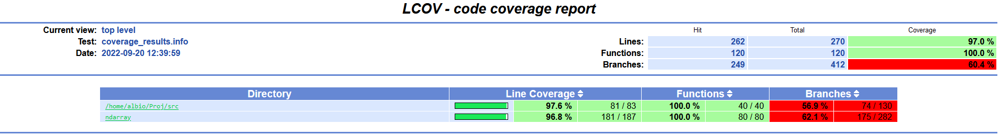

# Thunder

## Autori

Alberto Carli VR473845 [E-Mail](mailto:alberto.carli_01@studenti.univr.it)

Aleardo Lodi VR463652 [E-Mail](mailto:aleardo.lodi@studenti.univr.it)

## Link progetto originale 

http://thunder-project.org/

## Descrizione del progetto
Il nostro progetto é una riscrittura di una sezione del codice di [thunder](https://github.com/thunder-project/thunder) in C++17. 
Il progetto originario é una collezione di librerie, suddivisa in piú pacchetti, per importare immagini o serie dati e poi analizzarle. 
Scritto in python puó essere eseguito in locale o con il supporto di uno Spark cluster.
Thunder é suddiviso in un core package che definisce delle semplici funzioni di lettura e scrittura dei dati e da vari pacchetti (si veda [questo](https://github.com/thunder-project/thunder-regression) o [questo](https://github.com/thunder-project/thunder-registration)) di supporto.

Il progetto non é piú in attivamente sviluppato e supportato, per cui durante la fase di benchmark abbiamo trovato alcune funzioni che tornano errori.


## Il porting
### Scelte implementative
Il nostro porting della libreria comprende due componenti principali: il caricamento dei dati e l'applicazione di alcune operazioni classiche sui dati.
Per quanto concerne il caricamento dei dati in un oggetto generico della nostra libreria é possible tramite vari sistemi:
- Passare al costruttore C-like array o altri sequence iterators
- Caricare un'immagine di tipo png
- Caricare un'immagine di tipo tif
- Estrarre una serie numerica o serie da un file

Questi dati vengono poi salvati in un vector all'interno della relativa classe che si basa su ndarray. Le funzioni di elaborazione dei dati appartengono alla classe ndarray, mentre funzioni specifiche per caricare e manipolare i dati appropriatamente si trovano nelle classi series e images.
Delle funzioni aggiuntive sono state scelte la maggior parte presente nel pacchetto base di [thunder](https://github.com/thunder-project/thunder).
Quali ad esempio: count, max, min, filter, std, var...


## Program workflow
Innanzi tutto è necessario caricare i dati in qualche maniera. Si possono utilizzare diverse funzioni a seconda della classe, appropriate al tipo di struttura dati che vogliamo modellare e alle sue caratteristiche

## I/O esempi

Come dati d'input é possibile caricare immagini, array o serie numeriche. 
Per quanto riguarda le serie numeriche basta che il file sia composto da numeri separati da uno spazio.
Le immagini devono essere di due formati, tif o png, per essere caricate e poi elaborate.

## Code statistics 
### __cloc tool__
### Coverage
Man mano che venivano implementati i metodi venivano scritti anche i relativi unit test con ```Catch2``` fino al raggiungimento di una line coverage soddisfacente.
La coverage viene rilevata con ```lcov```, che viene utilizzato nel target ```make coverage```
per ottenere line, function e branch coverage, stamparla a schermo e generare, nella cartella ```doc/coverage```, un report in html.



### Static analysis (maybe)

## Testing

É stata usata la libreria catch2 importata in third_party/ per eseguire i test. 
Per ogni componente principale sono stati creati dei file equivalenti per il testing, sia per testare il caricamento di file e immagini sia per tutte le funzioni create.


## Third party libraries

Come librerie esterne é stato usato catch2 per testare il programma e CImg per poter leggere i file immagine e caricare in memoria immagini di vari formati. 
É stata scelta questa libreria perché la piú semplice e che conteneva tutto quello che ci serviva per caricare le immagini.


## Performance C++ vs Python

Come si puó vedere dai grafici sotto riportati le performance, con il flag di compilazione -O3, portano tutte C++ al primo posto come tempi di esecuzione.
Per quanto riguarda la lettura delle immagini direttamente da file non é stato possibile testare i file png.


